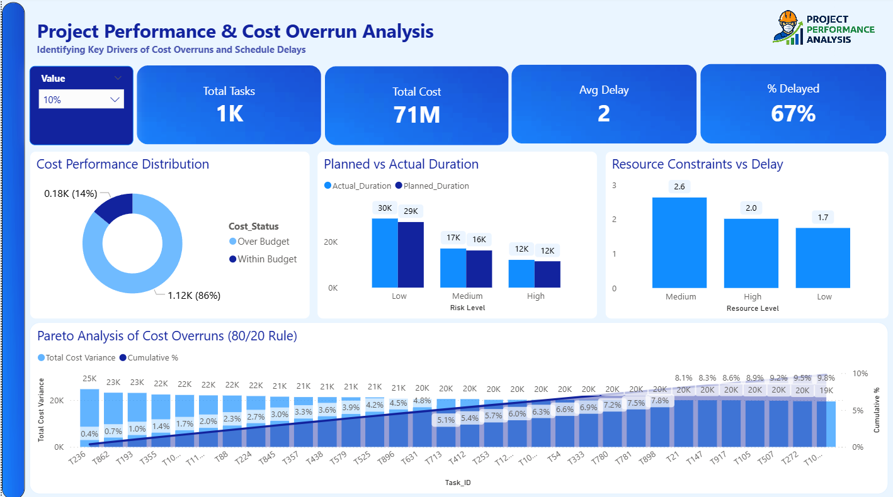

# 📊 Construction Project Performance Dashboard

## 🚀 Overview

This project presents an interactive Power BI dashboard designed to analyze construction project performance, focusing on cost overruns and schedule delays.

The dashboard helps identify key problem areas and supports data-driven decision-making for better project planning, execution, and cost control.

---

## 🎯 Objectives

* Analyze project cost and schedule performance
* Identify key drivers of delays and cost overruns
* Evaluate the impact of risk levels and resource constraints
* Apply Pareto analysis (80/20 rule) to highlight critical tasks

---

## 📊 Dashboard Preview

---

## 📌 Key Features

* KPI Tracking (Total Tasks, Total Cost, Avg Delay, % Delayed)
* Cost Performance Analysis (Over Budget vs Within Budget)
* Schedule Performance (Planned vs Actual Duration)
* Risk Impact Analysis
* Resource Constraints Analysis
* Pareto Analysis for Cost Overruns

---

## 🧠 Key Insights

* A significant percentage of tasks are delayed, indicating scheduling inefficiencies
* Delays are not strongly linked to risk or resource constraints, suggesting planning issues
* A small number of tasks contribute to the majority of cost overruns (Pareto principle)

---

## 🛠️ Tools & Technologies

* Power BI
* Power Query
* DAX
* Data Visualization

---

## 📂 Project Structure

* `images/` → Dashboard screenshots
* `dashboard.pbix` → Power BI file
* `README.md` → Project documentation

---

## 💡 Business Value

This dashboard enables project managers to:

* Identify critical problem areas
* Focus on high-impact tasks
* Improve cost control and scheduling accuracy
* Support better strategic decision-making

---

## 📬 Contact

If you have any questions or collaboration opportunities, feel free to reach out.

Amr Youssef 
Data Analyst
